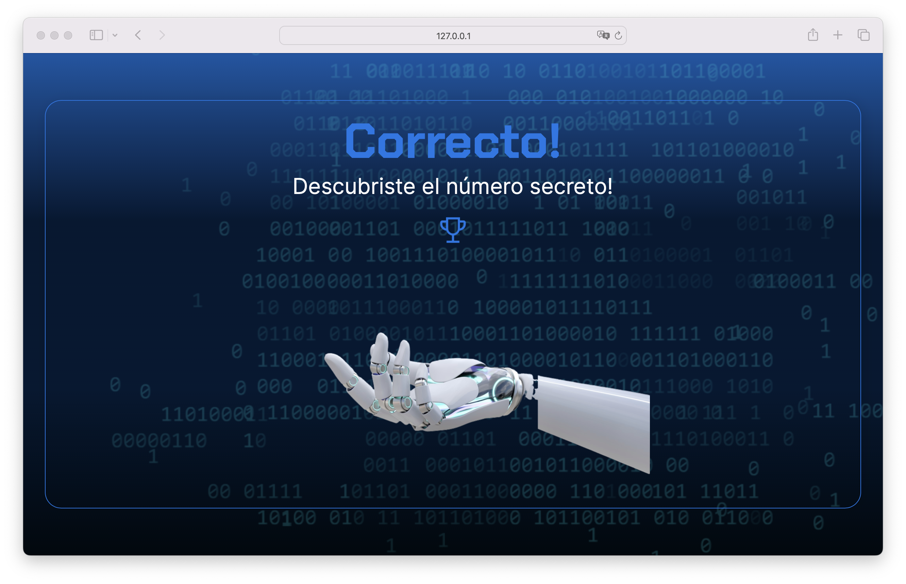

# Number Guesser V1

**Number Guesser** is a simple and fun game where your goal is to guess a secret number between 1 and 100 in up to 6 attempts. The game provides clues indicating whether the entered number is higher or lower than the secret number. Once you guess correctly within the allowed attempts, you'll receive congratulations and find out how many attempts it took you to succeed. This game is perfect for programming beginners, casual gamers, and anyone who enjoys logic and puzzle challenges.

## Screenshots

## Tech Stack

**Client:** HTML, CSS, JavaScript

## Prerequisites

- **Visual Studio Code (VSCode)**: You can download it from [Visual Studio Code](https://code.visualstudio.com/).

## Installation Steps

### Download the project:

1. Download the project from the repository or directly as a ZIP file.

### Open the project in Visual Studio Code:

1. Unzip the ZIP file (if you downloaded the project as a ZIP).
2. Open Visual Studio Code.
3. Select `File` > `Open Folder` and navigate to the downloaded project folder.

### Run the application:

1. If you're only using HTML, CSS, and JavaScript, simply open the `index.html` file in your preferred web browser.
2. Alternatively, you can use the Live Server extension in VSCode to run the application locally:
   - Install the **Live Server** extension from the VSCode marketplace.
   - Right-click the `index.html` file and select `Open with Live Server`.

That's it! You should now be able to play the **Number Guesser V1** game in your browser.

## Author

- [@jorgedoiany](https://github.com/jorgedoiany)
